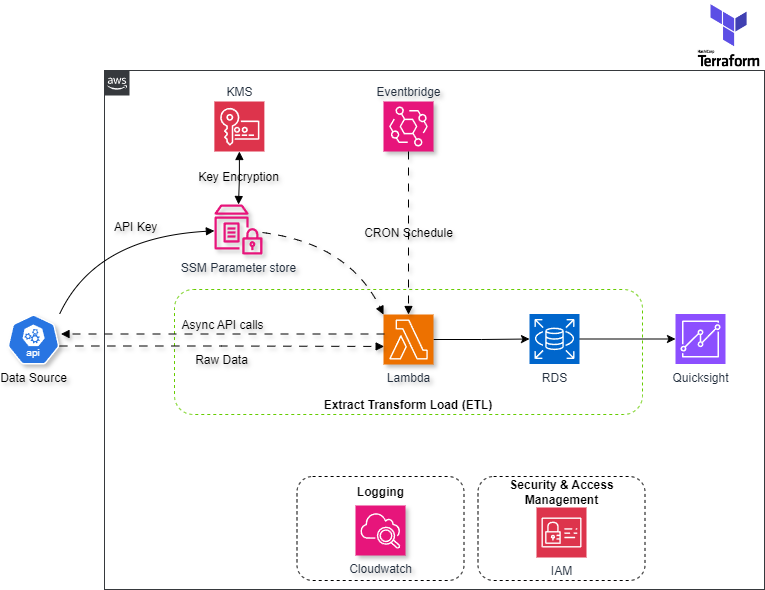

**Description:** Weather & Energy.

---

<h1>
AWS Architecture
</h1>

---

* **Data Collection:** REST API calls
* **Scripting Language:** Python
* **Infrastructure provisioning and maintenance:** Terraform

___

🌐 AWS Stack:

* **Parameter Store:** Secure storage for API keys with KMS encryption
* **EventBridge:** Scheduling CRON jobs to trigger Lambda function
* **Lambda:** Run Python Script for Data Extraction and Transformation
* **S3:** Storing the generated reports
* **RDS:** Data modeling
* **Quicksight:** Data visualization
* **CloudWatch:** Logging and monitoring
* **IAM:** Managing roles and policies
